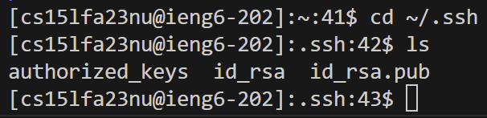

## Part 1

## Part 2

## Part 3

In lab 2, I didn't know that I could access a terminal from a computer from a different location using ssh. 
What I also learned in lab report 3 was that I did not know I could use Java to make my own search engine.
