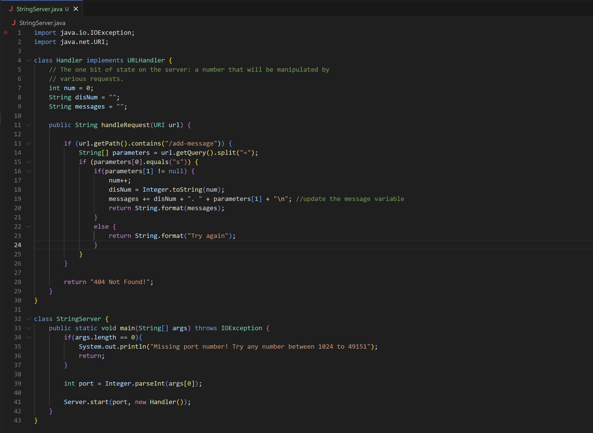
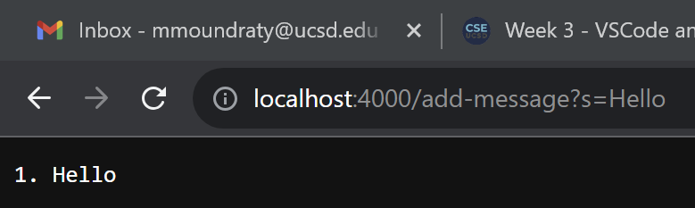
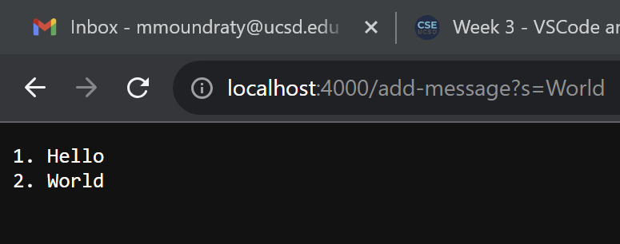
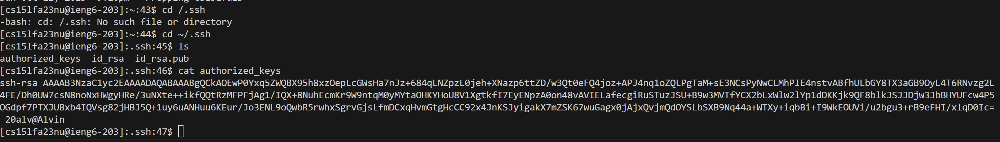
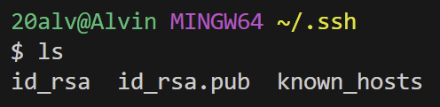
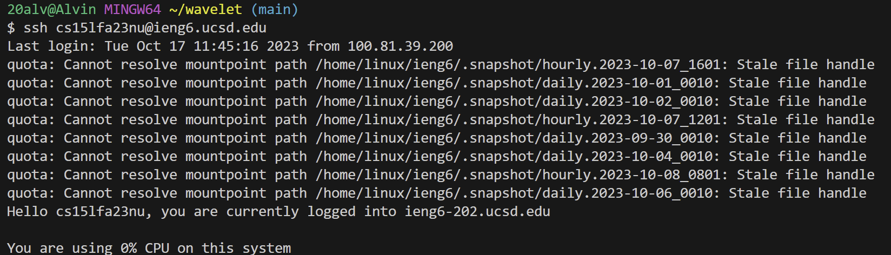
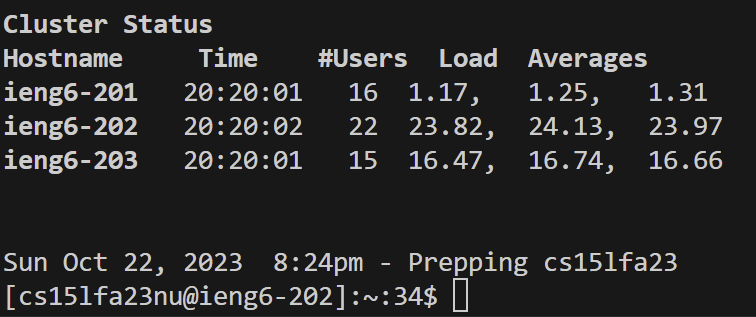

## Part 1

The method handleRequest is being called. The relevant arguments for handleRequest are `URI url` `getQuery()` `split()`.
The values of the relevant fields of the class are "=" and "s". The value of `parameters[1]` changes each time the user
enters a string in the query such as entering "Hello".

The method handleRequest is being called. The relevant arguments for handleRequest are `URI url` `getQuery()` `split()`.
The values of the relevant fields of the class are "=" and "s". The value of `parameters[1]` changes each time the user
enters a string and makes a new line for the input such as entering "World" and the website changes to the second line.

## Part 2

This is the path to the private key.

This is the path to the public key.

This is the terminal interaction of logging into ieng6 without a password being asked.

## Part 3

In lab 2, I didn't know that I could access a terminal from a computer from a different location using ssh. 
What I also learned in lab report 3 was that I did not know I could use Java to make my own search engine.
